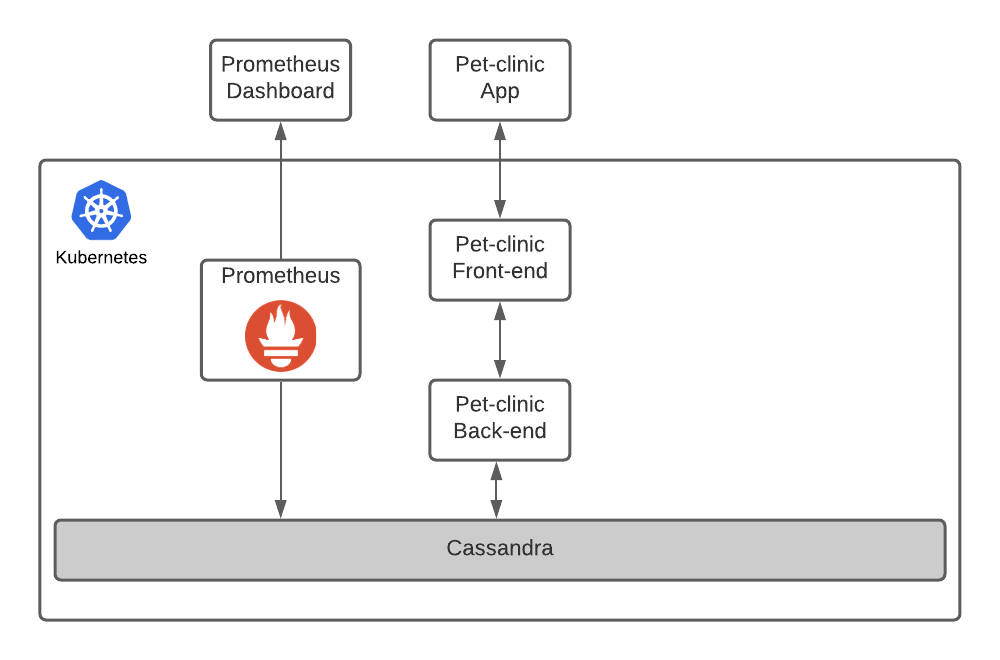

# Proyecto Final Cloud Computing

## ¿Por qué se escogió esta aplicación?

Debido a la pandemia, hubo un aumento en la adopción de mascotas debido a que en estos tiempos de encierro, las personas prefieren tener compañía. Como no se podía salir con familia y amigos, encuentran reconfortante la presencia de animales. 

Con este aumento, es necesario que las veterinarias necesiten de una base de datos escalable donde puedan ingresar la información de las mascotas ya que cada día las personas están adoptando una nueva mascota.

## Aplicaciones

Ecosistema: k8ssandra
- Base de datos:Cassandra
- Front-end: Angular
- Back-end: Spring framework

## ¿Qué está incluido en k8ssandra?
- Cassandra-Operator - Un CRD Kubernetes preparado para correr Cassandra
- Prometheus - Herramienta de recopilación de métricas
- Grafana - Una UI con dashboards para observar métricas obtenidas por Prometheus
- Reaper - Utilidad para mantener consistencia de datos en el cluster de Cassandra
- Medusa - Una utilidad de copia de seguridad creada especialmente para Cassandra
- Stargate - Servicio que proporciona múltiples APIs, como REST, GraphQL, etc para los datos de Cassandra

## Características de computación en la nube

El escalamiento en el almacenaje sea dinámico, no se tenga que detener la aplicación cuando se necesita incrementar el volumen. Esto lo hicimos mediante Dynamic Volume Provisioning que proporciona k8s.
Tener un balance de carga para no saturar nodos y atender varios clientes (nginx)

## Características de Cassandra:
Aprueba de Fallas: Cassandra brinda confianza en que su arquitectura no haya ningún error cuando existan varios nodos conectados en un cluster. Si es que llegase a fallar un nodo, el clúster debería de poder continuar con sus operaciones que estaba realizando.
Alta Escalabilidad: Debe de soportar una cantidad masiva de nodos y debería de ser posible añadir un nuevo nodo sin la necesidad de detener los procesos realizados por el clúster.
Alta distribuidad y Alta disponibilidad: La información puede ser repartida en los nodos del cluster y ser accedida por cualquiera de ellos. De tal forma que si llegase a fallar algún nodo, la arquitectura seguirá funcionando.
Mayor rendimiento: La lectura y escritura de los datos es la más óptima, ya que puede ser usada en tiempo real.

## Arquitectura de Cassandra:
Cassandra está diseñada de tal forma que no hay una jerarquía de nodos maestros y esclavos.
Tiene una arquitectura de tipo anillo, es decir las conexiones entre los nodos tiene la forma de un anillo.
Los datos son distribuidos automáticamente entre los nodos.
Los datos son almacenados en memoria y escritos en disco.
Los datos se replican en los nodos para brindar redundancia.
Los valores hash de las llaves se utilizan para distribuir los datos entre los nodos del clúster.

## Arquitectura del Proyecto:

## Commandos
1. `helm install k8ssandra-cluster-a k8ssandra/k8ssandra \
  -f config-values.yaml` Lanzar K8ssandra
2. `kubectl wait \
  --for=condition=Ready cassandradatacenter/dc1 \
  --timeout=240s` Esperar a que CASSANDRA inicie por completo
 3.`kubectl apply -f petclinic.yaml` lanzar app
 4. `while [ $(curl localhost:80/petclinic/api/pettypes 2> /dev/null | wc -l) -gt 0 ];
  do
    sleep 1
  done` Esperar que la app se conecte con Casssandra
