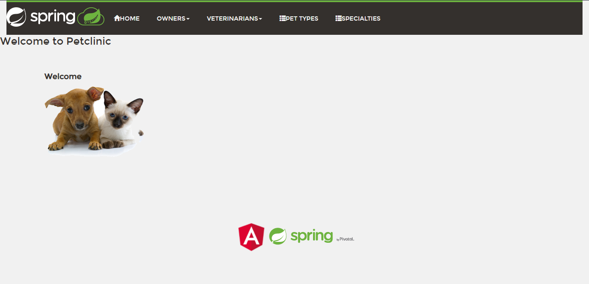

# Proyecto Final Cloud Computing

## ¿Por qué se escogió esta aplicación?

Debido a la pandemia, hubo un aumento en la adopción de mascotas debido a que en estos tiempos de encierro, las personas prefieren tener compañía. Como no se podía salir con familia y amigos, encuentran reconfortante la presencia de animales. 

Con este aumento, es necesario que las veterinarias necesiten de una base de datos escalable donde puedan ingresar la información de las mascotas ya que cada día las personas están adoptando una nueva mascota.

## Aplicaciones

Ecosistema: k8ssandra
- Base de datos:Cassandra
- Front-end: Angular
- Back-end: Spring framework

## ¿Qué está incluido en k8ssandra?
- Cassandra-Operator - Un CRD Kubernetes preparado para correr Cassandra
- Prometheus - Herramienta de recopilación de métricas
- Grafana - Una UI con dashboards para observar métricas obtenidas por Prometheus
- Reaper - Utilidad para mantener consistencia de datos en el cluster de Cassandra
- Medusa - Una utilidad de copia de seguridad creada especialmente para Cassandra
- Stargate - Servicio que proporciona múltiples APIs, como REST, GraphQL, etc para los datos de Cassandra

